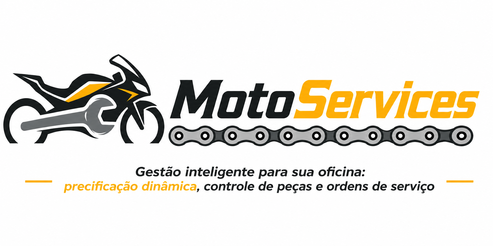

<p align="center">
  
</p>

<p align="center">
  <strong>Sistema de gestão de ordens de serviço exclusivo para oficinas de motocicletas.</strong><br/>
  Unifique venda de peças, mão de obra e histórico de revisões — com precificação dinâmica baseada no modelo da moto.
</p>

<p align="center">
  
  
  
  
  
  
  
</p>

---

## Visão Geral

O **MotoServices** é um sistema de gestão de ordens de serviço (OS) para oficinas de motocicletas. Ele unifica o fluxo de venda de peças avulsas, instalação e prestação de serviços técnicos (revisões), sendo alimentado por uma base de dados dinâmica para motos (marcas, modelos, cilindradas). O sistema também conta com cadastro de cliente para acompanhamento de revisões futuras e emissão de comprovantes.

O sistema automatiza esse fluxo, separando o que é **venda de produto** do que é **mão de obra**, e gera comprovantes de serviço ao fechar cada OS.

## Objetivos

**Geral:** Gerenciar e orçar serviços de manutenção, revisões, vendas de peças e substituição de peças para motocicletas, garantindo rastreabilidade, consistência de estoque e histórico do cliente.

**Específicos:**

- Encontrar e validar marca e modelo das motos a partir de base dinâmica.
- Calcular o custo da mão de obra de forma dinâmica com base em cilindradas e modelo.
- Aplicar regras de desconto progressivo (≥ 5 peças da loja = 5% sobre o total de peças).
- Diferenciar o cálculo quando a peça é fornecida pela loja ou trazida pelo cliente.
- Realizar cadastro do cliente para acompanhamento de revisões posteriores.
- Controlar estoque de peças com baixa automática e alertas de ruptura.
- Emitir comprovante de serviço (NF) ao fechar uma OS.
- Agendar revisões periódicas com notificação por calendário para o cliente.

---

## Atores

| Ator | Responsabilidade |
|---|---|
| **Mecânico / Chefe de Oficina** | Cria a OS, identifica a moto, diagnostica e insere os serviços — informando se as peças saem do estoque da loja ou são fornecidas pelo cliente. |
| **Atendente / Caixa** | Consulta a OS finalizada, registra a forma de pagamento e emite o comprovante (NF). |
| **Cliente** | Recebe a NF e a OS do serviço realizado. Acompanha revisões periódicas pelo calendário. |
| **Administrador** | Gerencia cadastro de peças e estoque, registra novas motos na base, configura tabelas de preço e gera relatórios gerenciais. |

---

## Features

### Precificação Dinâmica de Serviços e Peças
Motor de cálculo de orçamento que diferencia tipo de serviço, origem da peça e perfil da moto. Cobre orçamentos de revisão com fator de risco por cilindradas, troca de peças com ou sem peça da loja, desconto progressivo por volume e exibição consolidada do resumo.

### Gestão de Ordens de Serviço (OS)
Ciclo de vida completo de uma OS — da abertura ao fechamento com emissão de NF. Inclui múltiplos serviços por OS, fluxo de status (`ABERTA → EM_ANDAMENTO → AGUARDANDO_CLIENTE → CONCLUÍDA → FECHADA`) e histórico por cliente ou moto.

### Controle de Estoque de Peças
Inventário com cadastro, baixa automática ao confirmar OS e alertas de ruptura. Lança `EstoqueInsuficienteException` quando não há peças disponíveis e registra entradas por compra do administrador.

### Cadastro de Clientes e Histórico de Revisões
Relacionamento com o cliente: cadastro com CPF/CNPJ, vinculação de motos, histórico completo de OSs e calendário de próximas revisões. Busca por nome, CPF ou placa.

### Catálogo de Motos (Marcas e Modelos)
Base de dados dinâmica com marcas, modelos, cilindradas. Valida a moto ao criar a OS (`MotoInvalidaException` se não encontrada) e expõe filtros por faixa de cilindradas ou valor.

### Relatórios e Faturamento
Visão gerencial de desempenho: faturamento por período separado por peças e mão de obra, serviços mais realizados, clientes com maior volume de atendimento e exportação de OSs por período.

---

## Stack Tecnológica

| Camada | Tecnologia | Por quê |
|---|---|---|
| **Linguagem** | Java 17 | Tipagem forte, ecossistema robusto para sistemas corporativos. |
| **Framework** | Spring Boot 3 | Configuração mínima, injeção de dependência e suporte nativo a REST. |
| **Persistência** | PostgreSQL + Spring Data JPA + Hibernate | ORM maduro com suporte a herança de entidades. |
| **Migrações (DB)**| Flyway | Controle de versão do esquema do banco de dados (scripts em `db/migration`). |
| **Build** | Maven | Gerenciamento de dependências e ciclo de build padronizado. |
| **Testes** | JUnit 5 + Mockito | TDD com mocks para as camadas BO/DAO sem necessidade de banco real nos testes unitários. |
| **Documentação API** | SpringDoc OpenAPI (Swagger UI) | Geração automática de contrato em `/swagger-ui.html`. |
| **Validação** | Jakarta Bean Validation | Anotações `@NotNull`, `@CPF`, etc. nas entidades e VOs. |

---

## Estrutura do Repositório

```

```

---

## Estrutura das camadas do projeto

O sistema adota um padrão arquitetural rígido visto na disciplina de POO, dividido em responsabilidades bem definidas. A separação garante que modificações na interface gráfica ou no banco de dados não afetem as regras de negócio centrais. 

```text
┌────────────────┐       VOs transitam      ┌────────────────┐       VOs transitam      ┌────────────────┐
│      VIEW      │ ───────────────────────► │       BO       │ ───────────────────────► │      DAO       │
│ Interface User │       Ex: MotoVO         │ RegrasdeNegócio│       Ex: PecaVO         │ Acesso a Dados │
│                │ ◄─────────────────────── │                │ ◄─────────────────────── │                │
└────────────────┘       OrcamentoVO        └────────────────┘        ClienteVO         └───────┬────────┘
                                                                                                │  ▲
                                                                                      Query SQL │  │ ResultSet
                                                                                                ▼  │
                                                                                        ┌────────────────┐
                                                                                        │ BANCO DE DADOS │
                                                                                        │  (Relacional)  │
                                                                                        │ SCHEMA.TB_MOTO │
                                                                                        │  SCHEMA.TB_OS  │
                                                                                        └────────────────┘
```

* **VIEW (Apresentação):** A interface direta com o usuário. Responsável estritamente por capturar entradas e exibir resultados na tela, sem realizar cálculos ou acessar o banco.


* **BO (Business Object - Negócio):** O cérebro do sistema. Centraliza todas as validações, cálculos e regras da aplicação, processando os dados e orquestrando o que deve ser persistido ou recuperado.


* **DAO (Data Access Object - Persistência):** Camada exclusiva de comunicação com o banco de dados. Mapeia as operações em instruções SQL (CRUD), garantindo a manipulação correta das tabelas e o uso obrigatório de `OWNER/SCHEMA` na nomeação dos objetos.


* **VO (Value Object / DTO):** Estruturas de dados simples e sem comportamento lógico. Funcionam exclusivamente como "pacotes" para transportar informações com segurança entre a View, o BO e o DAO.


---

## Diagrama de Sequência

Fluxo completo de criação e fechamento de uma Ordem de Serviço:


```
Mecânico      View          BO              DAO            Banco
   │            │             │               │               │
   │── buscarMoto(marca, modelo) ──►          │               │
   │            │── encontrarMoto() ─────────►│               │
   │            │             │── selecionarMoto()───────────►│
   │            │             │◄──────────── MotoVO ──────────│
   │            │             │  [alt: MotoInvalidaException] │
   │◄── MotoVO validada ──────│               │               │
   │                          │               │               │
   │── criarOS(clientId, moto) ──────────────►│               │
   │            │             │── encontrarCliente()─────────►│
   │            │             │◄──────────── ClienteVO ───────│
   │            │             │  [alt: ClienteNaoEncontradoException]
   │                          │               │               │
   │  [loop] adicionarServico(tipo, params) ─►│               │
   │            │             │  [se TrocaPeca && pecaLoja]   │
   │            │             │── checarEstoque() ───────────►│
   │            │             │◄──────────── PecaVO ──────────│
   │            │             │  [alt: EstoqueInsuficienteException]
   │            │             │  os.servicos.add(servico)     │
   │                          │               │               │
   │── calcularOrcamento() ──────────────────────────────────►│
   │            │             │  [loop] s.calcularValorFinal(moto) // polimorfismo
   │            │             │  [se >= 6 peças loja] desconto = totalPecas * 0.03
   │◄── OrcamentoVO ──────────│               │               │
   │                          │               │               │
   │── confirmarOS() ────────────────────────────────────────►│
   │            │             │── inserirOS() ───────────────►│
   │            │             │── atualizarEstoque() ────────►│
   │◄── osId confirmado ──────│               │               │
   │                          │               │               │
Atendente                     │               │               │
   │── fecharOS(osId, pagamento) ────────────►│               │
   │            │             │── atualizarStatusOS(FECHADA)─►│
   │            │             │── agendarProximaRevisao() ───►│
   │◄── NF + OrcamentoVO ─────│               │               │
```

---

## Diagrama de Classes

```
<<interface>>
Precificavel
+ calcularValorFinal(moto: Moto): double
        ▲
        │ implements
        │
abstract ServicoDaOficina
- id: int
- descricao: String
- tempoEstimado: int
- valorBaseMaoDeObra: double
+ calcularValorFinal(moto: Moto): double  {abstract}
        ▲                   ▲
        │                   │
ServicoRevisao      ServicoTrocaPeca
- checklistGeral    - pecaEnvolvida: Peca
                    - pecaFornecidaPelaLoja: boolean

Moto                        Cliente
- id: int                   - id: int
- marca: String             - nome: String
- modelo: String            - cpfCnpj: String
- cilindradas: int          - contato: String
                            - proximaRevisao: LocalDate

Peca                        OrdemDeServico
- id: int                   - id: int
- codigo: String            - cliente: Cliente
- descricao: String         - moto: Moto
- valor: double             - status: StatusOS (enum)
- quantidadeEstoque: int    - servicos: List<ServicoDaOficina>
- estoqueMinimo: int        - dataAbertura: LocalDateTime
+ isAbaixoDoMinimo(): bool  - dataFechamento: LocalDateTime

OrcamentoVO (Value Object)   Exceptions
- totalPecas: double         EstoqueInsuficienteException
- totalMaoDeObra: double     MotoInvalidaException
- descontoAplicado: double   ClienteNaoEncontradoException
- totalFinal: double

BO Layer                        DAO Layer
OrdemDeServicoBO                OrdemDeServicoDAO
ClienteBO                       ClienteDAO
EstoqueBO                       PecaDAO
MotoBO                          MotoDAO
```

---

## Testes (JUnit 5)


**`OrdemDeServicoBOTest`**

```
- `testeDescontoAplicado()` — desconto de 3% ativo com ≥ 6 peças da loja
- `testeSemDesconto()` — sem desconto com ≥ 6 peças
- `testeMotoMaoDeObraExtra()` — cilindradas > 400 cc gera acréscimo de 50% e > 650 cc gera acréscimo de 70% na mão de obra
- `testePecaAvulsa()` — peça comprada por fora: cobra só mão de obra
- `testeExcecaoEstoqueInsuficiente()` — exceção ao usar peça sem estoque
- `testeExcecaoMotoInvalida()` — exceção ao buscar moto inexistente
- `testeExcecaoClienteNaoEncontrado()` — exceção ao buscar cliente inexistente
- `testeTotaisDoOrcamentoVOEstaoCorretos()` — totais do VO consistentes com as regras

```

**`OrdemDeServicoDAOTest`**
```
- `testeInserirOS()` — persistência de nova OS no banco
- `testeAtualizarStatusOS()` — transição de status refletida na tabela
- `testeSelecionarOSPorCliente()` — listagem de OSs por `clienteId`
- `testeAtualizarEstoqueAposOS()` — baixa automática de estoque ao confirmar OS
- `testeSelecionarPecasComBaixoEstoque()` — query retorna apenas peças abaixo do mínimo

```

---

## Licença

MIT — ver [LICENSE](./LICENSE).

---

<p align="center">
  <sub>Feito para garantir mais previsibilidade ao mecânico e ao cliente.</sub>
</p>
